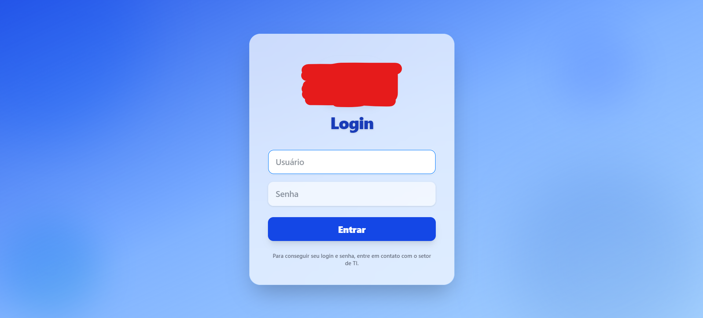
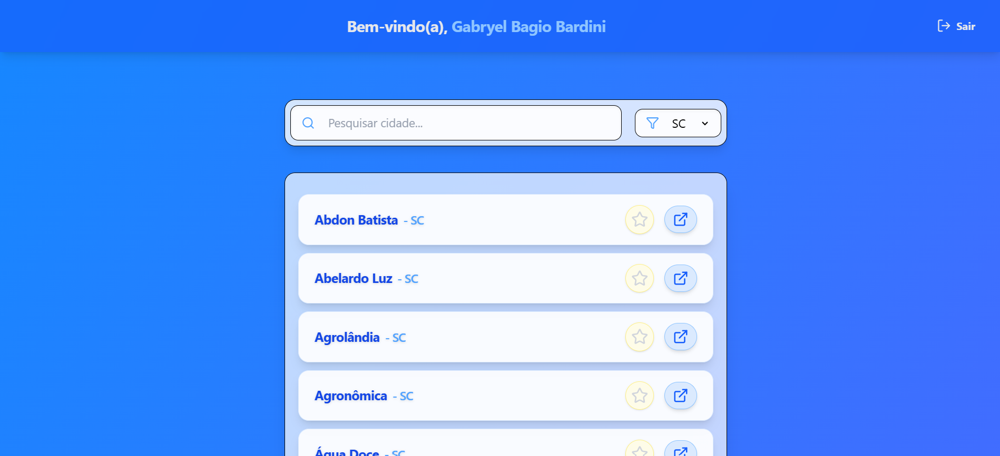
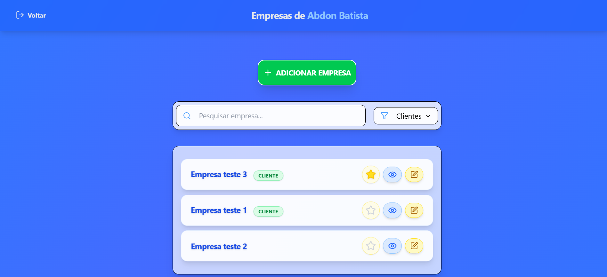
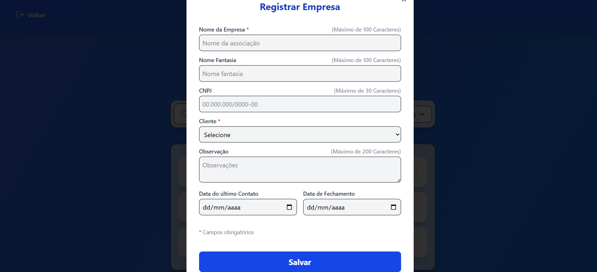
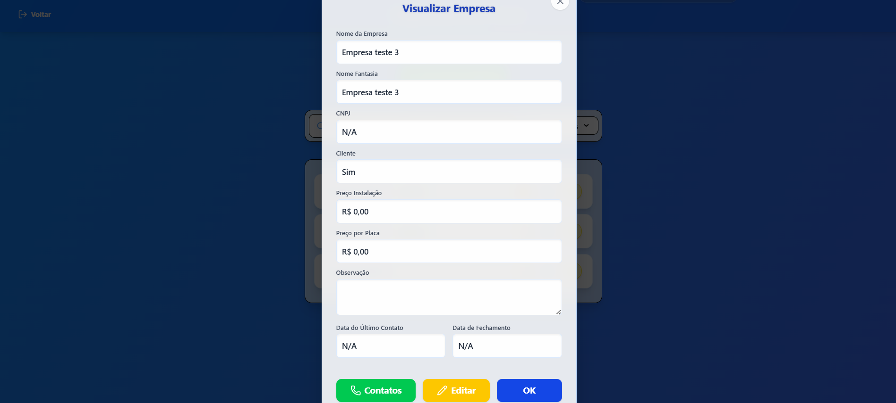

# Commercial Share System

Sistema completo de gestão comercial interna, com foco em controle de empresas (associações), cidades, usuários e contatos. Desenvolvido com stack moderna fullstack: **React + Vite** no frontend e **Node.js + Express** no backend, com suporte a **Docker** para fácil deploy.

---

## Tecnologias Utilizadas

### Backend
- Node.js
- Express
- Sequelize (ORM)
- MySQL
- dotenv
- express-session
- cookie-parser
- jwt
- bcrypt
- CORS

### Frontend
- React
- Vite
- React Router DOM
- TailwindCSS
- Axios

### Infraestrutura
- Docker

---

## Funcionalidades

- [x] Cadastro, edição e remoção de **empresas (associações)**
- [x] Gerenciamento de **cidades**
- [x] Controle de **usuários** com autenticação via sessão
- [x] Cadastro, inativação e gerenciamento de **usuários**
- [x] Registro e organização de **contatos** relacionados às empresas
- [x] Sistema de login com validação de token
- [x] Sistema de refresh token para sessão alongada
- [x] Interface simples, funcional e responsiva
- [x] Backend com rotas protegidas

---

## Tela Inicial







---

## Como Executar Localmente

### Requisitos
- Docker e Docker Compose
- Node.js
- Git

### Passos:

```bash
# Clone o repositório
git clone https://github.com/seu-usuario/commercial_share_system.git
cd commercial_share_system
``` 

1. Crie um arquivo `.env` na raiz do projeto baseado no `.env.example.`

2. No MySQL Workbench (ou similar), copie e execute os comandos de inicialização da pasta `migration.`

``` bash
# Execute os containers
docker compose up --build
```

### Acesse:
- Frontend: http://localhost:4173
- Backend: http://localhost:3030

## Contribuição

Contribuições são bem-vindas! Sinta-se à vontade para abrir issues e pull requests com melhorias, correções ou sugestões.

## Autor:

**Gabryel Bagio Bardini**
<a href="https://www.linkedin.com/in/gabryelbardini/">Linkedin</a> | <a href="https://github.com/ByelBardini">Github</a>